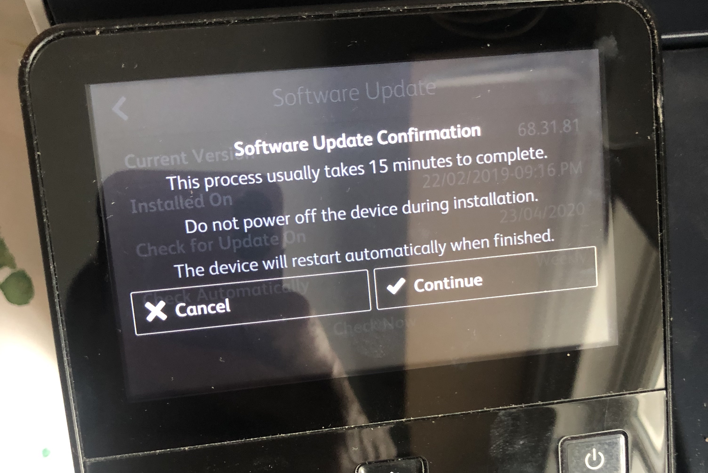

This is my Xerox Versalink C405 printer.
It works fine on my Mac and from phones and tablets.
But it rarely prints from the Windows 10 Laptop
 
---


It fails with errors like this. Unfortnately I am the sys admin so I have to fix it

---


I tried to do a Software Update from the printer but no dice.

---


---
(video:
  file: assets/spin.mov
  sync: loop)

I tried uploading the new firmware over the lan but it hung

---


When I went to look at the printer it had this message 'WRITE ERROR 041-500' on the screen.
It was bricked.

---


Next i tried updating the firmware via USB from a Windows PC.
That didn't work either.

---
```
1. Download the firmware (.bin) file, refer to support page for the printer.

1. Create a folder named ‘DWLD’ on the USB memory device (FAT formatted).

1. Store the software download file (.bin) in the ‘DWLD’ folder

1. Switch off the machine,  Insert the USB memory device (rear of the printer).

1. Simultaneously press then hold down the Home and Power buttons until the device powers on and SPECIAL BOOT MENU appears,

1. Simultaneously touch the letters A in SPECIAL, B in BOOT and the Home button. Do not hold any of the three locations, just touch/press then release simultaneously

1. At the keypad screen enter code number: 6789#. The SPECIAL BOOT MENU 1/3 screen will display.

1. Select Download Mode on SPECIAL BOOT MENU 1/3, then touch YES. The UI will display SW update progress. The machine will eventually reboot several times
```

Fortunately I found these instructions on the Internet. I put the firmware on a USB key and started the recovery process.

---


Getting the Special Boot menu up was easy enough, just hold down Home and Power.
Then it gets harder. You have to press the 'A' in special and the 'B' in boot at the same time.
It took me forever to get this right. Fortunately someone had made a YouTube video of themselves doing it. You couldn't really see what they did but it meant it looked like it was possible.

---


After the special boot you enter some magic numbers...

---


Then you hit Download Mode...

---


And you are off to the races.

---


At last the bloody thing works again.

Now to see if I can print from Windows!